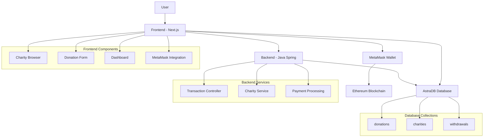
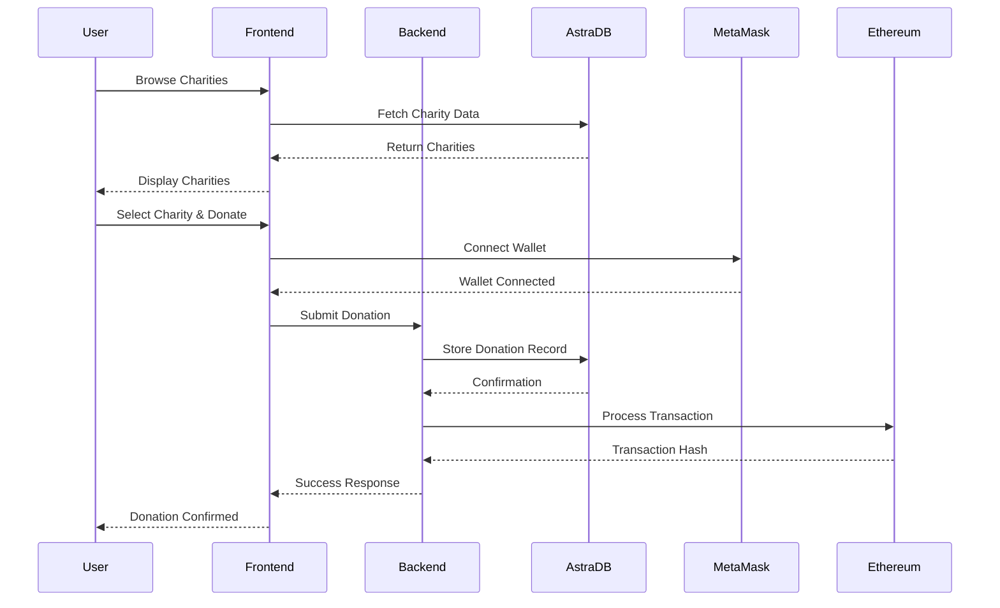

# 🌟 Trace the Change - Blockchain Charity Platform

<div align="center">


[](https://vercel.com/meaganali09-8233s-projects/v0-landing-page-design)
[](https://v0.dev/chat/projects/dSv148WdWLH)
[](https://nextjs.org/)
[](https://www.typescriptlang.org/)
[](https://tailwindcss.com/)
[](https://astra.datastax.com/)

*Automatically synced with your [v0.dev](https://v0.dev) deployments*

</div>

---

## 📋 Table of Contents

- [Overview](#overview)
- [🚀 Features](#-features)
- [🏗️ Architecture](#️-architecture)
- [⚡ Quick Start](#-quick-start)
- [🔧 Installation](#-installation)
- [🗄️ AstraDB Setup](#️-astradb-setup)
- [📊 Database Structure](#-database-structure)
- [🔗 Deployment](#-deployment)
- [📝 Important Notes](#-important-notes)

---

## 📖 Overview

This repository will stay in sync with your deployed chats on [v0.dev](https://v0.dev).
Any changes you make to your deployed app will be automatically pushed to this repository from [v0.dev](https://v0.dev).

## 🚀 Features

<div align="center">

| Feature | Description | Status |
|---------|-------------|--------|
| 💳 **Multi-Payment Support** | Credit card, bank transfer, cryptocurrency (ETH) | ✅ Active |
| 🔗 **MetaMask Integration** | Seamless crypto donations | ✅ Active |
| 📊 **Real-time Tracking** | Track donations and impact metrics | ✅ Active |
| 🌐 **Charity Discovery** | Browse and select from verified charities | ✅ Active |
| 🔒 **Blockchain Transparency** | Immutable transaction records | ✅ Active |
| 📱 **Responsive Design** | Works on all devices | ✅ Active |

</div>

## 🏗️ Architecture



## ⚡ Quick Start

<div align="center">

```bash
# Clone the repository
git clone <repository-url>
cd <repository-directory>

# Install dependencies
npm install
# or
pnpm install

# Set up environment variables
cp .env.example .env

# Start development server
npm run dev
# or
pnpm dev
```

**🌐 Open [http://localhost:3000](http://localhost:3000)**

</div>

## 🔧 Installation

### Prerequisites

<div align="center">

| Requirement | Version | Status |
|-------------|---------|--------|
| Node.js | 18.x or higher | ✅ Required |
| npm/pnpm | Latest | ✅ Required |
| AstraDB Account | Free tier | ✅ Required |
| MetaMask | Browser extension | ✅ Optional |

</div>

### Step-by-Step Setup

#### 1. Clone and Install

```bash
# Clone the repository
git clone <repository-url>
cd <repository-directory>

# Install dependencies
npm install
# or
pnpm install
```

#### 2. Environment Configuration

Create a `.env` file in the root directory:

```env
# AstraDB Configuration
ASTRADB_TOKEN=your_astradb_token
ASTRADB_ID=your_astradb_id
ASTRADB_REGION=your_astradb_region
ASTRADB_NAMESPACE=charity_donations
```

#### 3. Database Setup

```bash
# Run the setup script to verify connection and seed data
node scripts/setup-astradb.js
```

#### 4. Start Development

```bash
# Start the development server
npm run dev
# or
pnpm dev
```

**🎯 Test your setup at [http://localhost:3000/test-astra](http://localhost:3000/test-astra)**

## 🗄️ AstraDB Setup

### 1. Create an AstraDB Account

<div align="center">

[](https://astra.datastax.com/)

</div>

- Go to [https://astra.datastax.com/](https://astra.datastax.com/)
- Sign up for a free account

### 2. Create a Database

<div align="center">

| Setting | Value | Description |
|---------|-------|-------------|
| **Name** | `charity_platform` | Your database name |
| **Keyspace** | `charity_donations` | Database namespace |
| **Provider** | AWS/GCP/Azure | Your preferred cloud |
| **Region** | Closest to you | For optimal performance |

</div>

### 3. Generate Application Token

1. Wait for database initialization (2-3 minutes)
2. Click on your new database
3. Navigate to the "Connect" tab
4. Click "Generate Token"
5. Select "Database Administrator" role
6. Copy the generated token

### 4. Get Database Information

<div align="center">

| Environment Variable | Location | Description |
|---------------------|----------|-------------|
| `ASTRADB_ID` | Connect tab | Database ID |
| `ASTRADB_REGION` | Connect tab | Database region |
| `ASTRADB_TOKEN` | Generated token | Authentication token |

</div>

### 5. Update Environment Variables

```env
ASTRADB_TOKEN=your_generated_token
ASTRADB_ID=your_database_id
ASTRADB_REGION=your_database_region
ASTRADB_NAMESPACE=charity_donations
```

### 6. Setup Database

```bash
# Verify connection and seed data
node scripts/setup-astradb.js
```

### 7. Restart Application

```bash
# Restart to load new environment variables
npm run dev
```

## 📊 Database Structure

<div align="center">

### Collections Overview

| Collection | Purpose | Key Fields |
|------------|---------|------------|
| **donations** | Store donation records | id, donor, charity, amount, status |
| **charities** | Charity information | id, name, category, wallet address |
| **withdrawals** | Track withdrawals | id, charityId, amount, status |

</div>

### Detailed Schema

#### Donations Collection
```json
{
  "id": "unique_id",
  "donor": {
    "name": "string",
    "email": "string",
    "wallet": "string"
  },
  "charity": "charity_id",
  "amount": "number",
  "currency": "string",
  "message": "string",
  "paymentMethod": "string",
  "transactionHash": "string",
  "status": "string"
}
```

#### Charities Collection
```json
{
  "id": "unique_id",
  "name": "string",
  "category": "string",
  "description": "string",
  "walletAddress": "string",
  "impact": "string",
  "location": "string",
  "images": ["string"],
  "goals": "string"
}
```

#### Withdrawals Collection
```json
{
  "id": "unique_id",
  "charityId": "string",
  "amount": "number",
  "currency": "string",
  "transactionHash": "string",
  "status": "string"
}
```

## 🔗 Deployment

Your project is live at:

<div align="center">

**[🌐 https://vercel.com/meaganali09-8233s-projects/v0-landing-page-design](https://vercel.com/meaganali09-8233s-projects/v0-landing-page-design)**

</div>

Continue building your app on:

<div align="center">

**[🚀 https://v0.dev/chat/projects/dSv148WdWLH](https://v0.dev/chat/projects/dSv148WdWLH)**

</div>

## 🔄 How It Works

<div align="center">



</div>

## 📝 Important Notes

<div align="center">

| Note | Description |
|------|-------------|
| 🔧 **Development Mode** | Mock database client used if AstraDB credentials not provided |
| 🚀 **Production** | Always use proper AstraDB credentials |
| 💰 **Crypto Transactions** | Simulated in demo version |
| 📊 **Data Storage** | All transaction data stored in AstraDB regardless of payment method |

</div>

---

<div align="center">

### 🌟 Built with ❤️ for Citi Hackathon 2025

[](https://github.com/your-username)
[](LICENSE)

**Transform charitable giving through blockchain technology** 🚀

</div>
